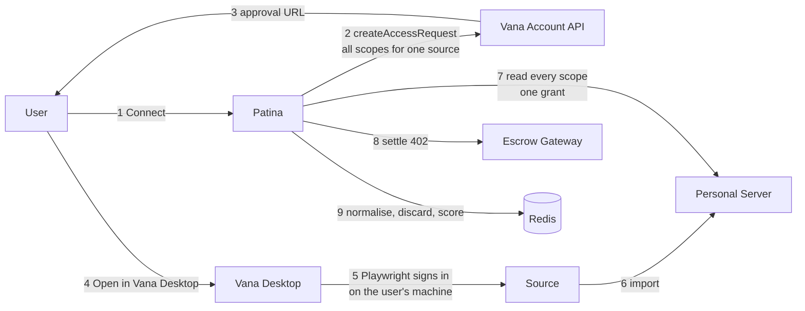
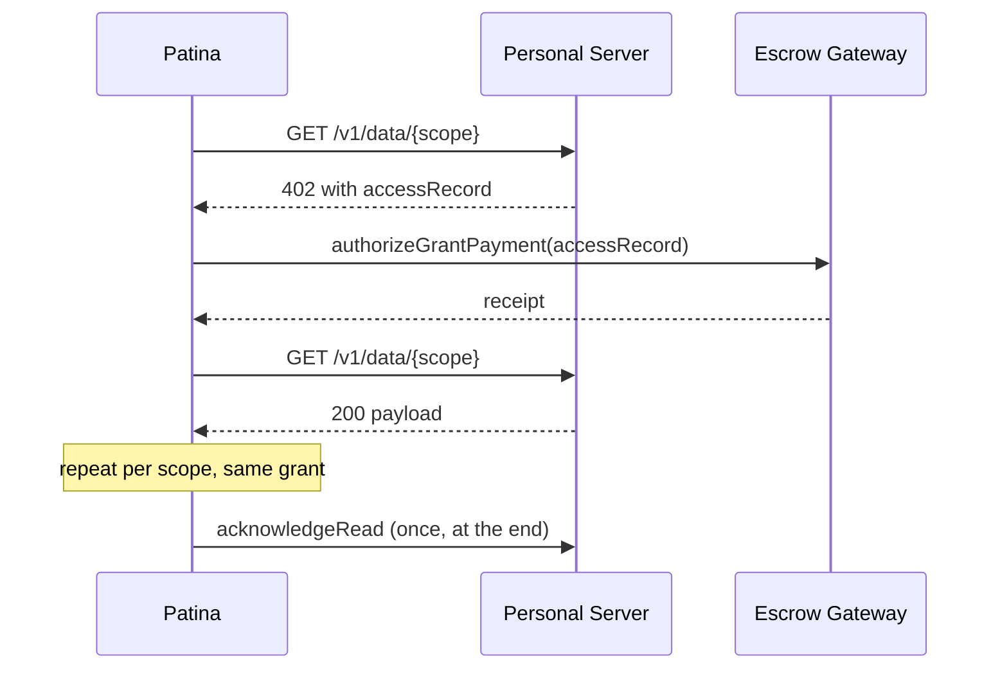
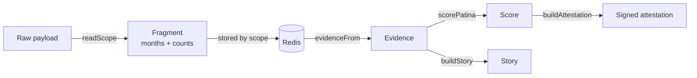

<p align="center">
  
</p>

<h1 align="center">Patina</h1>

<p align="center">
  <strong>Proof of tenure for accounts a person already owns</strong><br>
  <em>Anyone can make a new account. Nobody can make an old one.</em>
</p>

<p align="center">
  <a href="https://patinadata.xyz">Live App</a> &bull;
  <a href="https://patinadata.xyz/docs">Documentation</a> &bull;
  <a href="https://patinadata.xyz/mcp">MCP Server</a> &bull;
  <a href="https://patinadata.xyz/verify">Verify a score</a>
</p>

<p align="center">
  <a href="#overview">Overview</a> &bull;
  <a href="#the-score">The Score</a> &bull;
  <a href="#what-is-read-and-what-is-kept">Privacy</a> &bull;
  <a href="#architecture">Architecture</a> &bull;
  <a href="#quick-start">Quick Start</a> &bull;
  <a href="#integration">Integration</a> &bull;
  <a href="#test-results">Test Results</a>
</p>

---

## Live Deployments

| Surface | URL |
|---------|-----|
| **App** | [patinadata.xyz](https://patinadata.xyz) |
| **Docs** | [patinadata.xyz/docs](https://patinadata.xyz/docs) |
| **MCP** | [patinadata.xyz/api/mcp](https://patinadata.xyz/api/mcp) |
| **Verifier** | [patinadata.xyz/verify](https://patinadata.xyz/verify) |
| **Registry** | `io.github.ramakrishnanhulk20/patina` |
| **Signing address** | `0x620dDbEceaD28Bbf1b979bfaB8e3a7B893aa54A1` |

---

## Overview

Patina reads the history in accounts somebody already owns and turns it into portable, verifiable evidence that a real human has been there for years. It is built on [Vana](https://vana.org), the data portability protocol: the data lives in the user's own Personal Server, is read once under a grant they can revoke, and never passes through an OAuth handoff that keeps it.

Sybil resistance is unsolved and expensive. An airdrop, a quadratic funding round, a DAO vote or a free trial all need to know whether they are talking to a thousand people or to one person with a thousand wallets. The usual answers are poor: biometrics are invasive, KYC destroys privacy, and most behavioural signals can simply be bought.

Somebody running an account farm can buy followers, bulk-upload posts and fill in a convincing profile. What they cannot buy is **a decade**.

### Why Patina?

|  | KYC | World ID / proof of personhood | Patina |
|---|---|---|---|
| Proves years of history | No | No | **Yes** |
| Proves you are one unique person | Partly | **Yes** | No |
| Works without a wallet | Yes | No | **Yes** |
| Works without biometrics | Yes | No | **Yes** |
| User can revoke access afterwards | No | No | **Yes** |
| Another app can reuse the proof | No | Yes | **Yes** |

Patina answers **tenure**, not uniqueness. A freshly verified unique human can be produced today; sixteen years of corroborated activity cannot. The two are complementary, and the tool descriptions say so rather than implying otherwise.

---

## Features

### Ownership proved, not assumed

Collection is meant to run through **Vana Desktop**, which opens a browser on the user's own machine and asks them to sign in. Credentials never leave the device and Patina never sees a password.

But Vana has two collection paths and does not report which one it used. The other reads a **public page** from a profile URL, which proves an account exists and nothing about who holds it. So "desktop only" cannot be asked for; it has to be forced.

Every source therefore requires one scope a public page cannot serve, and the read is **refused** if it does not come back. LinkedIn must produce connection dates, Spotify saved tracks, YouTube its Watch Later list. A request containing something private cannot be answered from a public profile, so the person ends up on Desktop and has to log in. `sources.test.ts` fails if a source is ever added without one.

Steam was withdrawn for the same reason. Its connector never signs anybody in: it takes a Steam Web API key and a Steam ID, and a Steam ID is public. Anyone could have handed Patina a stranger's account age and friend dates as their own, and unlike YouTube there was no private scope to require instead.

### Nine sources, nineteen scopes

GitHub, LinkedIn, Spotify, Instagram, YouTube, Amazon, Uber, DoorDash and Shop. All of a source's scopes go in one approval, so the whole manifest is nine approval trips rather than nineteen.

### Timestamps in, content out

Every scope is requested for its dates. Captions, addresses, emails, track names, game titles and other people's names are discarded before anything is stored, and a test fails if any of them reach the store.

### Signed, portable, and dated

Every non-provisional score carries an EIP-191 attestation anyone can verify offline against Patina's published address. No key, no OAuth, CORS open.

Attestations **expire after thirty days**, and the expiry sits inside the signed message rather than beside it, so checking freshness stays offline too. A revocation list would have fixed the same problem by making every verifier call Patina, which is exactly the dependency people integrate to avoid. Scores are signed with a key separate from the one holding the escrow balance, so a leak of one is not a leak of both.

### Answerable about itself

`/api/health` does a real write-and-read against the database and a live read of the escrow balance, and returns **503** when the deployment cannot serve the next person, so ordinary uptime monitoring catches an outage without being taught what to look for. A password-gated `/admin` shows the funnel, the user numbers and how many more connections the balance will fund. Funnel counting is done server-side: no third-party script, no cookie banner, nothing that contradicts the privacy page.

### Readable by agents

An MCP server exposes the score to AI agents mid-conversation, with a handle resolver that returns tenure without revealing identity.

---

## The Score

Six components, weighted by how expensive each one is in **time** rather than in money.

| Component | Max | What it measures |
|---|---:|---|
| **Age** | 30 | The oldest date provable across every connected source. Full marks at twelve years. |
| **Continuity** | 25 | Distinct months the person was actually present for, as absolute count times coverage. |
| **Corroboration** | 15 | Independent sources agreeing on the date, each weighted by its own age. |
| **Vouches** | 12 | *When* other people chose to connect, not how many. Weighted by how long ago. |
| **Depth** | 10 | Things actually made, discounted when the volume arrived in one burst. |
| **Breadth** | 8 | Independent accounts backing each other up. |

Age and the two time components are earned outright. Depth, Vouches and Breadth are **gated** behind them: an attacker can manufacture volume, friends and breadth in an afternoon, so those only count to the extent that real elapsed history backs them up. A floor of 15% stops a genuinely young person being flattened to zero for the crime of being nineteen.

Scored against reference profiles, asserted in `score.test.ts`:

| Profile | Score |
|---|---:|
| Eleven active years across four accounts | **95** |
| Ordinary: eleven years, two accounts, real gaps | **71** |
| Genuinely young: three years, two accounts, real | **26** |
| Account farm: 3,900 bought followers, 120 posts in one week | **2** |

The gap between an ordinary person and a farm is 69 points. That gap is the product.

### Honest limits

Stated on the site itself, not buried here:

- **It cannot prove personhood.** It reports how much real history it can see. That is evidence, not a certificate.
- **A low score is not an accusation.** Young, private or quiet accounts score low and are doing nothing wrong.
- **Aged accounts can be bought.** That turns a free attack into an expensive one whose price climbs with age. It does not make it impossible.
- **Desktop proves session control, not ownership.** A bought account arrives with its password. The bar moves from "knows a username" to "holds the credentials", which is a large jump and not the same word.
- **The proof scope is a floor, not a guarantee.** Requiring something private forces a real sign-in, and a real sign-in is still only a sign-in. What it rules out is somebody scoring a stranger's public profile, which is the failure that would make the whole number meaningless.

---

## What is read, and what is kept

Every scope below is requested for its timestamps. This table is the trust argument, so it is on the privacy page in roughly this form too.

| Scope | Kept | Discarded on arrival |
|---|---|---|
| `linkedin.connections` | `dateConnected[]`, count | names, headlines, profile URLs |
| `instagram.posts` | `taken_at[]`, count | captions, images, likes, the entire `who_liked[]` array |
| `spotify.savedTracks` | `added_at[]`, total | track names, artists, albums |
| `github.history` | `createdAt[]`, hashed repo, summed engagement | PR and issue titles and bodies |
| `linkedin.experience` / `education` | parsed date ranges | companies, job titles, schools, grades |
| `uber.trips` | `requestTime[]`, count | **pickup and dropoff addresses**, fares, cities |
| `amazon` / `doordash` / `shop` orders | dates, count | items, merchants, totals, delivery addresses |
| `youtube.profile` | `joinedDate`, counts | **email address** |
| `youtube.watchLater` | nothing at all | everything; it is requested only as proof of a signed-in session |

Timestamps collapse to **month buckets** before storage. The scorer only ever asks about months, so holding anything finer would be holding it for no reason.

---

## Architecture

### Connect flow



### Read and settle



`acknowledgeRead` moves the request to `completed`, which is terminal and not read-ready. Firing it after the first scope would strand the rest behind a Personal Server no longer serving them, after the user had paid.

### Scoring pipeline



Fragments are keyed by scope and merged at scoring time. A retried read overwrites its fragment rather than adding its months a second time, so a stuttering connection cannot inflate a score.

---

## Quick Start

### Prerequisites

- Node 20+
- A Vana app identity from [account.vana.org/developers](https://account.vana.org/developers)
- Upstash Redis credentials (optional locally; falls back to an in-memory store)

### Installation

```bash
git clone https://github.com/ramakrishnanhulk20/Patina.git
cd Patina
npm install
cp .env.example .env.local
```

Fill in `VANA_APP_PRIVATE_KEY` and `VANA_APP_URL`, then register the app and fund its escrow:

```bash
npm run register:moksha
```

### Development

```bash
npm run dev          # development server
npm test             # 118 tests
npm run typecheck    # types, ignoring generated route types
npm run verify       # typecheck + tests + production build
```

---

## Integration

### REST

Any public score, no key and no OAuth:

```bash
curl https://patinadata.xyz/api/verify/ramkumar
```

```json
{
  "username": "ramkumar",
  "score": 71,
  "verdict": "Well established",
  "oldestYear": 2012,
  "yearsOfHistory": 13.6,
  "sourcesConnected": ["github", "linkedin", "spotify"],
  "provisional": false,
  "issuedAt": "2026-08-26T12:00:00.000Z",
  "expiresAt": "2026-09-25T12:00:00.000Z",
  "attestation": {
    "app": "0x...",
    "message": "Patina score attestation

username: ramkumar
score: 71/100
...
expiresAt: 2026-09-25T12:00:00.000Z
app: 0x...",
    "signature": "0x...",
    "expiresAt": "2026-09-25T12:00:00.000Z"
  }
}
```

### Verify an attestation offline

```javascript
import { verifyMessage } from "viem";

const ok = await verifyMessage({
  address: "0x620dDbEceaD28Bbf1b979bfaB8e3a7B893aa54A1",
  message: attestation.message,
  signature: attestation.signature,
});
```

### MCP

```json
{
  "mcpServers": {
    "patina": {
      "type": "http",
      "url": "https://patinadata.xyz/api/mcp"
    }
  }
}
```

| Tool | Answers |
|---|---|
| `get_patina_score` | The full breakdown for a Patina username |
| `check_threshold` | A yes/no trust gate on years, score or source count |
| `resolve_identity` | A GitHub, Instagram or LinkedIn handle to a score, without revealing identity |
| `verify_attestation` | Whether a signature is genuinely Patina's |

---

## Test Results

```
174 passing
```

| Suite | Tests | Covers |
|---|---:|---|
| `normalize.test.ts` | 30 | Envelope shapes, discard guarantees, idempotency |
| `score.test.ts` | 27 | Every component, the gating, the reference profiles |
| `store.test.ts` | 26 | Cross-device identity, usernames, removing one source, deletion |
| `mcp-lookup.test.ts` | 20 | Privacy rules on the resolver, signing, verdict drift |
| `story.test.ts` | 19 | Timeline, activity, exhibits, thin-history copy |
| `routes.test.ts` | 15 | Real HTTP requests: sessions, the signing floor, the admin gate |
| `device.test.ts` | 12 | Which devices can finish a connection |
| `attest.test.ts` | 10 | Signing, expiry, key separation, published-address drift |
| `sources.test.ts` | 9 | The ownership invariant: no source may be answerable from a public page |
| `ratelimit.test.ts` | 4 | Escrow abuse limits |
| `altcha.test.ts` | 2 | Proof-of-work bot check |

The one worth knowing about: **`nothing sensitive survives normalisation`** feeds in a payload stuffed with a real-looking email address, two home addresses, a caption, a colleague's full name and LinkedIn URL, a game title, an employer, a song, a product and a restaurant, then asserts that none of the thirteen appear anywhere in what gets saved.

---

## Project Structure

```
src/
├── app/
│   ├── api/
│   │   ├── vana/          request + data: the connect spine
│   │   ├── patina/        me, username, data, restore, delete
│   │   ├── admin/         session, index rebuild
│   │   ├── verify/        public score lookup
│   │   ├── badge/         embeddable SVG badge
│   │   └── mcp/           MCP server
│   ├── connect/           the evidence board, and the phone handoff
│   ├── my-data/           see it, download it, remove any of it
│   ├── admin/             the funnel, the numbers, the money left
│   ├── u/[username]/      public page and story
│   ├── verify/            verifier, including an offline checker
│   └── docs/              integration reference
└── lib/
    ├── score.ts           the whole argument, weight by weight
    ├── normalize.ts       18 scopes in, timestamps out
    ├── sources.ts         the manifest, and the proof scope each source must return
    ├── device.ts          whether this device can finish a connection at all
    ├── vana.ts            app identity, one controller per source
    ├── vana-settle-read.ts  paid reads, escrow settlement
    ├── escrow-balance.ts  how many more connections the balance will fund
    ├── metrics.ts         the funnel, counted server-side and nowhere else
    ├── store.ts           profiles keyed on Personal Server identity
    ├── admin.ts           one operator, one password, fails closed
    ├── story.ts           evidence as a narrative, and exhibits
    ├── attest.ts          signed attestations, expiring, on their own key
    └── mcp-lookup.ts      what an agent is allowed to learn
```

`src/lib/score.ts` is the whole argument. Every weight carries a comment explaining why it is what it is.

---

## Tech Stack

| Layer | Choice |
|---|---|
| Framework | Next.js 16, React 19, App Router |
| Language | TypeScript |
| Styling | Tailwind CSS 4, custom token layer |
| Data | Vana Data Portability Protocol (`@opendatalabs/vana-sdk`) |
| Storage | Upstash Redis, in-memory fallback |
| Signing | viem, EIP-191 |
| Agents | Model Context Protocol (`mcp-handler`) |
| Abuse | ALTCHA proof of work, per-session rate limits |
| Tests | `node:test`, no framework |

---

## License

MIT, see [LICENSE](LICENSE).

---

## Acknowledgments

Built on [Vana](https://vana.org) and its [Data Portability Protocol](https://docs.vana.org/data-portability-protocol). Connectors come from [PDP-Connect/data-connectors](https://github.com/PDP-Connect/data-connectors). Brand glyphs are from Simple Icons and Font Awesome's free brand set, both inlined so the app makes no external request.
